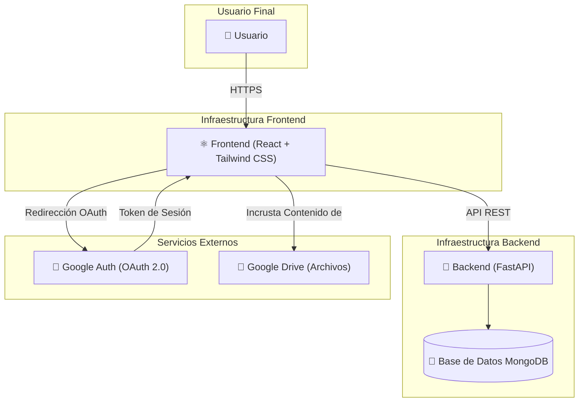

# Gestión de Formaciones de RITSI

Esta es la plataforma para gestionar el contenido formativo de la **Reunión de Estudiantes de Ingenierías Técnicas y Superiores en Informática (RITSI)**. Una plataforma completa para gestionar contenidos formativos, cuestionarios y seguimiento del progreso de los representantes universitarios de RITSI.

## Características Principales

### 🎓 Múltiples Roles de Usuario
- **Administrador**: Gestión completa de la plataforma, usuarios, universidades y comisiones.
- **Escuela de Formación**: Crea y valida contenidos formativos.
- **Coordinador Temático**: Gestiona los miembros de una comisión temática y les asigna formaciones.
- **Formador**: Crea contenido formativo que debe ser validado.
- **Junta Directiva**: Asigna contenido a todos los representantes.
- **Universidad**: Gestiona y asigna contenido a sus representantes.
- **Representante**: Accede y completa los contenidos formativos.
- **Colaboración Externa**: Accede a contenidos públicos.


### 📚 Gestión de Contenidos
- Contenidos formativos con videos, PDFs e imágenes alojados en Google Drive
- URLs compartidas de Google Drive para acceso controlado
- Descripción y organización de contenidos por temas
- Flujo de validación: los contenidos creados por "Formadores" deben ser aprobados.
- Contenidos públicos y privados.
- Organización por categorías.

### ✅ Sistema de Cuestionarios
- Tres tipos de preguntas: Verdadero/Falso, Opción Múltiple (una respuesta), Opción Múltiple (varias respuestas)
- Mínimo preestablecido 70% de aciertos para aprobar aunque es personalizable
- Reintentos ilimitados hasta aprobar

### 📊 Seguimiento de Progreso
- Marcado de archivos como completados
- Solo se puede acceder a cuestionarios después de completar todos los archivos
- Progreso en tiempo real
- Visualización del progreso individual por contenido.
- Acceso condicional a cuestionarios tras completar los archivos.

### 🏛️ Gestión de Entidades
- **Universidades**: Creación, edición y desactivación de universidades, con asignación por zonas (I-V).
- **Comisiones Temáticas**: Creación y gestión de comisiones, con asignación de un coordinador y miembros.


### 🔐 Autenticación
- Google OAuth a través de Emergent Auth
- Registro libre con asociación a universidad
- Integración directa con **Google OAuth 2.0** para un inicio de sesión seguro.

## Tecnologías

**Backend**: FastAPI, MongoDB, Motor, Pydantic
**Frontend**: React 19, React Router, Axios, Shadcn/UI, Tailwind CSS

## Inicialización

5 universidades de ejemplo están disponibles. Para poblar la base de datos con datos iniciales, puedes usar los siguientes scripts:

```bash
# Crear universidades de ejemplo
python3 /app/scripts/init_universities.py

# Crear un nuevo usuario con un rol específico
python3 /app/scripts/create_user.py "email@ejemplo.com" "Nombre Completo" "rol"

# Crear una nueva categoría
python3 /app/scripts/create_category.py "Nombre de la Categoría"
```

# Diagrama del servicio:

## Arquitectura

La plataforma sigue una arquitectura cliente-servidor desacoplada, utilizando React para el frontend y FastAPI para el backend.
 

