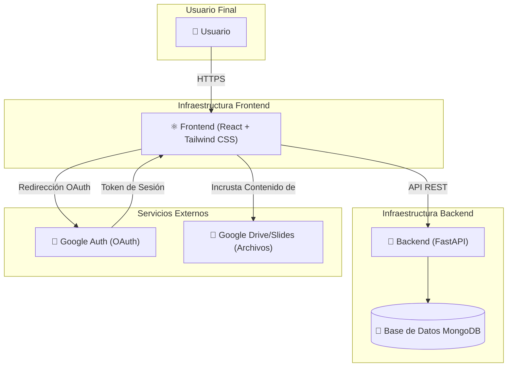

# Gestión de Formaciones de RITSI

Esta es la plataforma para gestionar el contenido formativo de la **Reunión de Estudiantes de Ingenierías Técnicas y Superiores en Informática (RITSI)**. Una plataforma completa para gestionar contenidos formativos, cuestionarios y seguimiento del progreso de los representantes universitarios de RITSI.

## Barrido técnico y roadmap

Se ha añadido un barrido del servicio con componentes extraídos y propuesta priorizada de incrementos funcionales en [`docs/barrido-servicio-y-roadmap.md`](docs/barrido-servicio-y-roadmap.md).

## Características Principales

### 🎓 Múltiples Roles de Usuario
- **Administrador**: Gestión completa de la plataforma, usuarios, universidades y vocalías.
- **Escuela de Formación**: Crea y valida contenidos formativos.
- **Vocalía**: Área de trabajo con responsable, orientada a recomendar y asignar formaciones sin asociar representantes.
- **Formador**: Crea contenido formativo que debe ser validado.
- **Junta Directiva**: Asigna contenido a todos los representantes.
- **Universidad**: Gestiona y asigna contenido a sus representantes.
- **Representante**: Accede y completa los contenidos formativos.
- **Colaboración Externa**: Accede a contenidos públicos.


### 📚 Gestión de Contenidos
- Contenidos formativos con videos, PDFs, imágenes y presentaciones alojados en Google Drive/Slides
- URLs compartidas de Google Drive y Google Slides para acceso controlado
- Descripción y organización de contenidos por temas
- Flujo de validación: los contenidos creados por "Formadores" deben ser aprobados.
- Contenidos públicos y privados.
- Organización por categorías.

### ✅ Sistema de Cuestionarios
- Tres tipos de preguntas: Verdadero/Falso, Opción Múltiple (una respuesta), Opción Múltiple (varias respuestas)
- Mínimo preestablecido 70% de aciertos para aprobar aunque es personalizable
- Reintentos ilimitados hasta aprobar

### 📊 Seguimiento de Progreso
- Marcado de archivos como completados
- Solo se puede acceder a cuestionarios después de completar todos los archivos
- Progreso en tiempo real
- Visualización del progreso individual por contenido.
- Acceso condicional a cuestionarios tras completar los archivos.

### 🏛️ Gestión de Entidades
- **Universidades**: Creación, edición y desactivación de universidades, con asignación por zonas (I-V).
- **Vocalías**: Creación y gestión de vocalías, con asignación de responsable y sin representantes asociados.


### 🔐 Autenticación
- Google OAuth 2.0 directo con credenciales propias de Google Cloud
- Registro libre con asociación a universidad

## Tecnologías

**Backend**: FastAPI, MongoDB, Motor, Pydantic
**Frontend**: React 19, React Router, Axios, Shadcn/UI, Tailwind CSS

## Inicialización

5 universidades de ejemplo están disponibles. Para poblar la base de datos con datos iniciales, puedes usar los siguientes scripts:

```bash
# Crear universidades de ejemplo en Docker
docker compose run --rm scripts python scripts/init_universities.py

# Sincronizar universidades españolas desde RUCT
docker compose run --rm scripts python scripts/sync_spanish_universities.py

# Asignar zonas RITSI a las universidades sincronizadas
docker compose run --rm scripts python scripts/assign_ritsi_zones.py

# Crear un nuevo usuario con un rol específico
docker compose run --rm scripts python scripts/create_user.py "email@ejemplo.com" "Nombre Completo" "rol"

# Crear una nueva categoría
docker compose run --rm scripts python scripts/create_category.py "Nombre de la Categoría"
```

## Despliegue con Docker

1. Copia `.env.example` a `.env` y ajusta los valores necesarios.
   Para el login con Google, rellena:

   ```bash
   FRONTEND_URL=http://localhost:3000
   GOOGLE_CLIENT_ID=...
   GOOGLE_CLIENT_SECRET=...
   GOOGLE_REDIRECT_URI=http://localhost:8000/api/auth/google/callback
   ```

   En Google Cloud crea un cliente OAuth de tipo **Web application** y registra exactamente el mismo `GOOGLE_REDIRECT_URI`.
   Si vas a usar un dominio propio en producción, añade y verifica el dominio raíz en la configuración de OAuth de Google y cambia `FRONTEND_URL` y `GOOGLE_REDIRECT_URI` a las URLs públicas reales.

   Mientras configuras OAuth en local, puedes activar un acceso temporal de desarrollo:

   ```bash
   ENABLE_DEV_LOGIN=true
   DEV_LOGIN_EMAIL=dev@local.test
   DEV_LOGIN_NAME="Usuario de desarrollo"
   DEV_LOGIN_ROLE=admin
   DEV_LOGIN_UNIVERSITY_ID=dev-local
   ```

   Ese botón solo aparece si lo habilitas expresamente y se bloquea cuando `COOKIE_SECURE=true`; no lo actives en producción.
2. Levanta la plataforma:

```bash
docker compose up --build -d
```

3. Abre `http://localhost:3000`. El frontend sirve la build de React con Nginx y proxy `/api` hacia el backend.

Para producción con dominios HTTPS separados, configura `CORS_ORIGINS`, `COOKIE_SECURE=true` y `COOKIE_SAMESITE=none`.

# Diagrama del servicio:

## Arquitectura

La plataforma sigue una arquitectura cliente-servidor desacoplada, utilizando React para el frontend y FastAPI para el backend.
 

