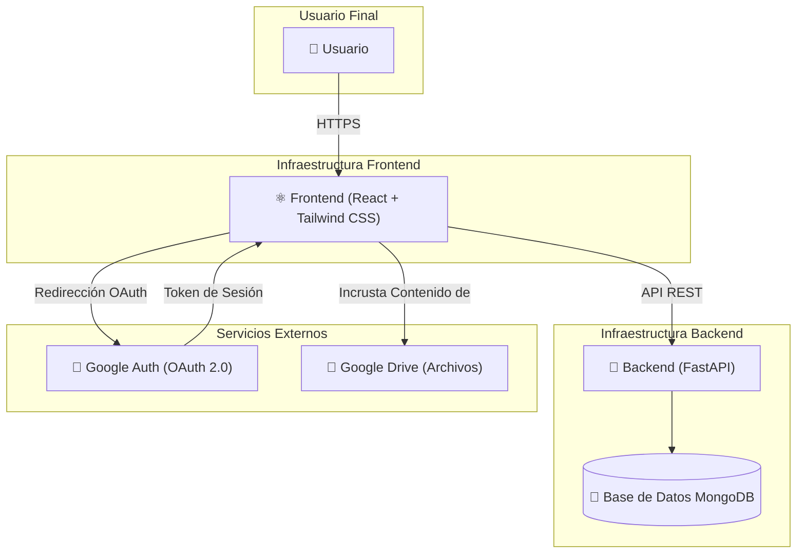

# Plataforma Formativa de RITSI

Esta es la plataforma formativa de la **Reunión de Estudiantes de Ingenierías Técnicas y Superiores en Informática (RITSI)**. Una plataforma completa para gestionar contenidos formativos, cuestionarios y seguimiento del progreso de los representantes universitarios de RITSI.

## Características Principales

### 🎓 Múltiples Roles de Usuario
- **Representante**: Accede y completa contenidos formativos asignados
- **Universidad**: Gestiona y asigna contenido a sus representantes
- **Junta Directiva**: Asigna contenido a todos los representantes
- **Escuela de Formación**: Crea contenido y cuestionarios, asigna a cualquier usuario
- **Administrador**: Gestión completa de la plataforma

### 📚 Gestión de Contenidos
- Contenidos formativos con videos, PDFs e imágenes alojados en Google Drive
- URLs compartidas de Google Drive para acceso controlado
- Descripción y organización de contenidos por temas

### ✅ Sistema de Cuestionarios
- Tres tipos de preguntas: Verdadero/Falso, Opción Múltiple (una respuesta), Opción Múltiple (varias respuestas)
- Mínimo 70% de aciertos para aprobar
- Reintentos ilimitados hasta aprobar

### 📊 Seguimiento de Progreso
- Marcado de archivos como completados
- Solo se puede acceder a cuestionarios después de completar todos los archivos
- Progreso en tiempo real

### 🔐 Autenticación
- Google OAuth a través de Emergent Auth
- Registro libre con asociación a universidad

## Tecnologías

**Backend**: FastAPI, MongoDB, Motor, Pydantic
**Frontend**: React 19, React Router, Axios, Shadcn/UI, Tailwind CSS

## Inicialización

5 universidades de ejemplo están disponibles. Para agregar más:
```bash
python3 /app/scripts/init_universities.py
```

# Diagrama del servicio:

## Arquitectura

La plataforma sigue una arquitectura cliente-servidor desacoplada, utilizando React para el frontend y FastAPI para el backend.
 

