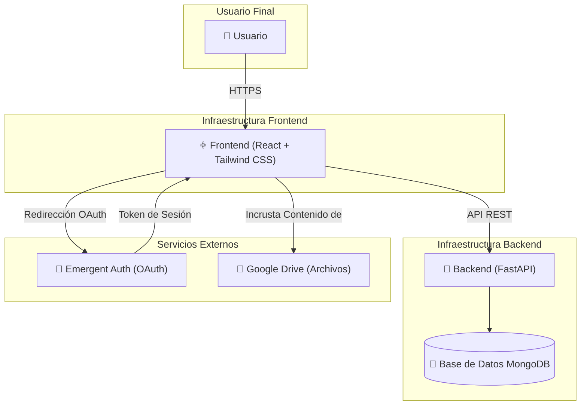

# Plataforma Formativa de RITSI

Esta es la plataforma formativa de la **Reunión de Estudiantes de Ingenierías Técnicas y Superiores en Informática (RITSI)**. Una plataforma completa para gestionar contenidos formativos, cuestionarios y seguimiento del progreso de los representantes universitarios de RITSI.

## Características Principales

### 🎓 Múltiples Roles de Usuario
- **Representante**: Accede y completa contenidos formativos asignados
- **Universidad**: Gestiona y asigna contenido a sus representantes
- **Junta Directiva**: Asigna contenido a todos los representantes
- **Escuela de Formación**: Crea contenido y cuestionarios, asigna a cualquier usuario
- **Administrador**: Gestión completa de la plataforma

### 📚 Gestión de Contenidos
- Contenidos formativos con videos, PDFs e imágenes alojados en Google Drive
- URLs compartidas de Google Drive para acceso controlado
- Descripción y organización de contenidos por temas

### ✅ Sistema de Cuestionarios
- Tres tipos de preguntas: Verdadero/Falso, Opción Múltiple (una respuesta), Opción Múltiple (varias respuestas)
- Mínimo 70% de aciertos para aprobar
- Reintentos ilimitados hasta aprobar

### 📊 Seguimiento de Progreso
- Marcado de archivos como completados
- Solo se puede acceder a cuestionarios después de completar todos los archivos
- Progreso en tiempo real

### 🔐 Autenticación
- Google OAuth a través de Emergent Auth
- Registro libre con asociación a universidad

## Tecnologías

**Backend**: FastAPI, MongoDB, Motor, Pydantic
**Frontend**: React 19, React Router, Axios, Shadcn/UI, Tailwind CSS
**Infraestructura**: Docker, Docker Compose

## Configuración del Entorno

### Variables de Entorno Requeridas

**Backend** (`backend/.env`):
```env
MONGO_URL=mongodb://localhost:27017/
DB_NAME=plataforma_formativa
EMERGENT_AUTH_URL=https://auth.emergentworks.com
EMERGENT_APP_ID=your_app_id
EMERGENT_APP_SECRET=your_app_secret
```

**Frontend** (`frontend/.env`):
```env
REACT_APP_BACKEND_URL=http://localhost:8000
```

## Instalación y Ejecución

### Opción 1: Docker Compose (Recomendado)

```bash
# Clonar el repositorio
git clone https://github.com/FranAnillo/plataforma-formaciones-ritsi.git
cd plataforma-formaciones-ritsi

# Configurar variables de entorno
cp backend/.env.example backend/.env
cp frontend/.env.example frontend/.env
# Editar los archivos .env con tus credenciales

# Iniciar todos los servicios
docker-compose up -d

# La aplicación estará disponible en:
# - Frontend: http://localhost:3000
# - Backend API: http://localhost:8000
# - MongoDB: localhost:27017
```

### Opción 2: Desarrollo Local

**Backend:**
```bash
cd backend
pip install -r requirements.txt
uvicorn server:app --reload --port 8000
```

**Frontend:**
```bash
cd frontend
npm install
npm start
```

## Inicialización de Datos

### Crear Universidades de Ejemplo

5 universidades de ejemplo están disponibles. Para agregar más:
```bash
python3 scripts/init_universities.py
```

### Crear Usuario Administrador

```bash
python3 scripts/create_admin.py admin@example.com "Admin Name"
```

### Crear Usuario con Rol Específico

```bash
python3 scripts/create_user.py user@example.com "User Name" <rol> [university_id]
```

Roles disponibles: `admin`, `escuela_formacion`, `junta_directiva`, `universidad`, `representante`

# Diagrama del servicio:

## Arquitectura

La plataforma sigue una arquitectura cliente-servidor desacoplada, utilizando React para el frontend y FastAPI para el backend.
 

