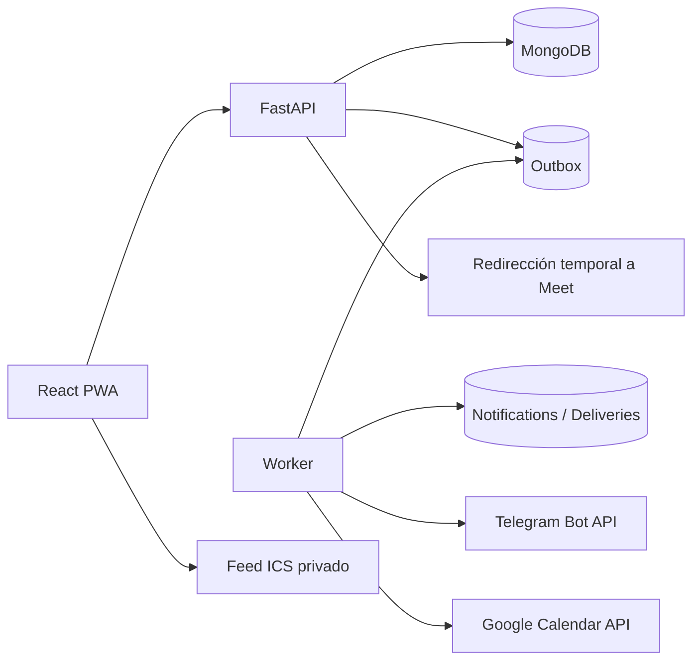
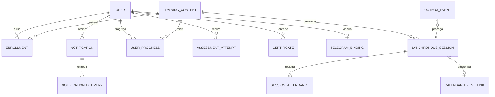

# Revisión global y matriz de aceptación

## 1. Resumen ejecutivo

La plataforma cubre el núcleo relevante para RITSI: gobierno y RBAC, catálogo, asignaciones e itinerarios, progreso, evaluaciones, certificados, sesiones síncronas, control temporal de acceso, asistencia, reporting, notificaciones multicanal, Telegram, calendario, auditoría, privacidad y operación. La arquitectura conserva MongoDB como fuente de verdad y usa un outbox persistente con un worker de entrega al menos una vez.

No se recomienda convertir el producto en un LMS generalista. SCORM/xAPI, foros, comercio, proctoring, IA generativa y aplicaciones nativas no resuelven una necesidad verificada del servicio actual y elevarían mucho el coste de seguridad y operación. La PWA cubre el uso móvil previsto.

## 2. Diagnóstico del sistema actual

Fortalezas verificadas:

- modelo de roles alineado con la estructura de RITSI;
- catálogo histórico con reimportación idempotente y propiedad de campos diferenciada;
- acceso a contenidos y sesiones validado en backend;
- enlaces de reunión cifrados y ausentes de los DTO ordinarios;
- frontend responsive y accesible mediante teclado;
- despliegue reproducible con contenedores no privilegiados, healthchecks y CI.

La deuda detectada en la revisión inicial —sesiones incompletas, respuestas de cuestionarios expuestas, progreso con autorización insuficiente, secretos versionados, falta de cola, integraciones y recuperación insegura— ha sido corregida. El riesgo operativo restante es externo: rotación de secretos históricos, credenciales reales de proveedores, backups y TLS pertenecen al entorno de despliegue.

## 3. Gap analysis respecto a una plataforma LMS moderna

| Capacidad | Estado | Evidencia funcional |
|---|---|---|
| Usuarios, roles y ámbitos | Completa | RBAC y alcance por universidad/autoría |
| Catálogo y contenidos | Completa | recursos, metadatos, importación previa, edición y revisión |
| Inscripción y asignación | Completa | individual, global y por itinerario |
| Itinerarios | Completa | creación, asignación y progreso agregado |
| Progreso y finalización | Completa | recursos + evaluaciones superadas |
| Sesiones síncronas | Completa | CRUD, participantes, estados, zona horaria y asistencia |
| Calendario | Completa | ICS por usuario y Google Calendar institucional opcional |
| Notificaciones | Completa | centro interno, preferencias, outbox y Telegram |
| Evaluaciones | Completa | autoría, corrección en servidor e historial de intentos |
| Certificados | Completa | emisión automática, verificación pública e impresión/PDF |
| Reporting y analítica | Adecuada al alcance | inscripciones, sesiones y asistencia por ámbito |
| Automatizaciones | Completa | eventos, recordatorios y transiciones temporales por worker |
| Accesibilidad y móvil | Completa para el alcance | responsive, teclado, foco, reducción de movimiento y PWA |
| Seguridad y privacidad | Completa para P0/P1 | cookies seguras, origen, hash de tokens, cifrado, rate limit y RGPD |
| Escalabilidad | Adecuada | índices, paginación acotada, outbox reclamable y worker independiente |

Benchmarking usado como referencia, no como lista de funciones a copiar:

- Moodle permite preferencias por tipo/canal y recordatorios de actividades, patrón adoptado en las preferencias de la plataforma: <https://docs.moodle.org/405/en/Notifications>.
- Canvas prioriza una vista de tareas/eventos y analítica separada por cuenta, curso y estudiante; aquí se traduce en “Mi formación”, sesiones e informes por ámbito: <https://community.canvaslms.com/t5/Student-Guide/How-do-I-use-the-to-do-list-for-all-my-courses-in-the-List-View/ta-p/345> y <https://community.canvaslms.com/html/assets/Canvas_Admin_Guide.pdf>.
- Open edX vincula finalización, progreso y certificado, que es el criterio aplicado para la emisión automática: <https://docs.openedx.org/en/latest/educators/references/data/progress_page.html> y <https://docs.openedx.org/en/latest/educators/concepts/open_edx_platform/about_certificates.html>.
- Google Classroom confirma el valor de integrar materiales, reuniones y Calendar, sin justificar replicar todo su modelo de aula: <https://support.google.com/edu/classroom/answer/6020279>.

## 4. Arquitectura objetivo

MongoDB conserva el estado canónico. El worker reclama eventos mediante bloqueo temporal, usa claves de idempotencia y reintenta con backoff. En una instancia MongoDB única no existe atomicidad multi-documento entre agregado y outbox; si se exige garantía transaccional estricta debe usarse un replica set y una transacción.

## 5. Integración con Telegram

La vinculación usa un token aleatorio de un solo uso y diez minutos de vigencia. El webhook verifica `X-Telegram-Bot-Api-Secret-Token`, acepta solo chats privados y vincula identificadores numéricos. `/stop` y la desvinculación desactivan el canal. Las entregas registran estado, intentos y proveedor; 429 respeta `retry_after`, los errores transitorios se reintentan y los rechazos permanentes desactivan el vínculo.

Los mensajes contienen un enlace a la plataforma, nunca el enlace de la reunión. Quien no vincula Telegram conserva los avisos internos.

## 6. Integración con Google Calendar

Se implementa la combinación recomendada:

- calendario institucional compartido mediante Calendar API para la agenda oficial;
- feed ICS privado por usuario para sus sesiones autorizadas;
- enlace interno persistente `session_id ↔ event_id/etag/hash` para actualizar el mismo evento.

No se invita automáticamente a cada participante al calendario institucional: evita exponer listas y enviar invitaciones duplicadas. Los feeds personales ya filtran por audiencia. La API institucional queda desactivada de forma segura cuando faltan credenciales.

## 7. Diseño de sesiones síncronas y Google Meet

Las sesiones admiten creación, edición, reprogramación, cancelación, participantes explícitos o heredados, asistencia y estados `draft/scheduled/live/ended/cancelled`. El worker persiste las transiciones temporales.

El backend cifra la URL y solo responde con una redirección 303 cuando identidad, audiencia, estado y ventana temporal son válidos. Esto oculta y bloquea el acceso desde la plataforma; no invalida una URL de Google Meet que una persona haya copiado previamente. Invalidar realmente una reunión depende de la propiedad y capacidades de Google Workspace/Calendar y no puede garantizarse ocultando el enlace local.

Las recurrencias no se incorporan porque no hay una necesidad verificada y requieren excepciones por ocurrencia, reprogramaciones parciales y reglas RFC complejas. Se modelarán como serie + ocurrencias materializadas cuando aparezca ese caso real.

## 8. Modelo de datos propuesto

Entidades implementadas: `User`, `TrainingContent`, `ContentAssignment`, `Enrollment`, `LearningPath`, `UserProgress`, `AssessmentAttempt`, `Certificate`, `SynchronousSession`, `SessionAttendance`, `OutboxEvent`, `Notification`, `NotificationDelivery`, `NotificationPreference`, `TelegramBinding`, `CalendarFeedToken`, `CalendarEventLink`, `PasswordResetToken`, `PrivacyRequest` y `ActivityLog`.

`Meeting` se representa como datos cifrados dentro de `SynchronousSession`: no tiene ciclo de vida independiente en el producto actual. Si se soportan varios proveedores o reuniones por sesión, debe extraerse a un agregado propio.

## 9. Automatizaciones y arquitectura de eventos

Eventos implementados: `TrainingAssigned`, `TrainingStarted`, `TrainingCompleted`, `SessionScheduled`, `SessionUpdated`, `SessionParticipantsUpdated`, `SessionRescheduled`, `SessionStarted`, `SessionEnded` y `SessionCancelled`. El worker genera avisos de asignación, progreso y finalización, además de recordatorios “mañana” y “hoy” calculados en la zona horaria local de la sesión; también sincroniza Calendar y cancela recordatorios obsoletos.

Las claves de deduplicación hacen seguras las reentregas. Administración dispone de estado operativo, reintento manual y reconciliación de Calendar.

## 10. Seguridad y privacidad

- contraseñas con bcrypt y tokens aleatorios almacenados mediante SHA-256;
- sesiones en cookie `HttpOnly`, `SameSite=Lax`, `Secure` configurable y revocación centralizada;
- protección exacta de origen para mutaciones autenticadas;
- autorización por recurso y ámbito, no solo por rol;
- URLs de reunión cifradas y no incluidas en notificaciones, ICS o Calendar;
- tokens de Telegram, calendario y recuperación de un solo uso o revocables;
- limitación de login compartida en MongoDB;
- logs y auditoría sin contraseñas, cookies, tokens ni URLs privadas;
- exportación personal y solicitud de supresión con reautenticación;
- secretos fuera del repositorio y servicios externos desactivables.

MFA/SSO corporativo queda como P3 condicionado a que RITSI disponga de un proveedor de identidad. Añadir OAuth social sin gobernanza central aumentaría el riesgo de cuentas duplicadas.

## 11. Mejoras adicionales del producto

Se añadieron edición editorial completa, evaluaciones, certificados imprimibles, gestión de perfil, PWA, asistencia, informes, itinerarios y panel operativo. No se añaden foros porque la coordinación actual ya usa canales organizativos y Telegram; Open edX demuestra su valor en cursos masivos, pero ese patrón no se ha verificado aquí: <https://docs.openedx.org/en/latest/educators/concepts/communication/about_course_discussions.html>.

### Fichas de las funcionalidades importantes

#### Sesiones síncronas y acceso a Meet

1. **Necesidad:** coordinar formación en directo sin publicar permanentemente la reunión.
2. **Comportamiento:** CRUD, audiencia heredada o explícita, estados, zona IANA y ventana configurable.
3. **Flujo:** la persona gestora programa; el worker avisa; el participante abre la sesión y solicita acceso; el backend redirige si procede.
4. **Frontend:** editor de sesión, selector de participantes, estados, asistencia y botón de acceso condicionado.
5. **Backend:** autorización por ámbito, validación temporal, cifrado y endpoint `POST /sessions/{id}/join`.
6. **Base de datos:** `synchronous_sessions`, `session_attendance` y eventos outbox.
7. **Servicios:** Google Meet es una URL de proveedor; no se necesita su API para controlar el acceso local.
8. **Riesgos:** enlace copiado, horario de verano, sesiones reprogramadas y fallo de proveedor.
9. **Casos límite:** fin igual al inicio, zona inválida, usuario desinscrito, cancelación y ventana exacta.
10. **Aceptación:** el DTO no contiene Meet y solo un participante válido dentro de la ventana recibe `303`.

#### Notificaciones multicanal y Telegram

1. **Necesidad:** informar de asignaciones y cambios sin exigir que la persona esté dentro de la web.
2. **Comportamiento:** centro interno, filtros, estado leído, preferencias, avisos de progreso, recordatorios por día y entrega Telegram opcional.
3. **Flujo:** un evento entra en outbox; el worker materializa el aviso; cada canal registra su resultado.
4. **Frontend:** centro de notificaciones, preferencias, vinculación, estado y desvinculación de Telegram.
5. **Backend:** tokens de vínculo, webhook secreto, operaciones de consulta/reintento y aislamiento de canal.
6. **Base de datos:** `notifications`, `notification_deliveries`, `notification_preferences` y `telegram_bindings`.
7. **Servicios:** Telegram Bot API; la arquitectura permite añadir email o push como nuevos adaptadores.
8. **Riesgos:** 429, chat bloqueado, token robado, duplicados y indisponibilidad del proveedor.
9. **Casos límite:** cuenta no vinculada, canal desactivado, cambio de audiencia y recordatorio obsoleto.
10. **Aceptación:** entrega idempotente y trazable; un fallo de Telegram nunca revierte la operación de negocio.

#### Calendario institucional y personal

1. **Necesidad:** mantener una agenda oficial y permitir que cada persona la incorpore a su calendario.
2. **Comportamiento:** API institucional opcional más feed ICS personal, revocable y filtrado por audiencia.
3. **Flujo:** crear/modificar/cancelar sesión emite evento; el worker actualiza Calendar; el usuario suscribe su ICS.
4. **Frontend:** creación/rotación/revocación del feed y acceso a sesiones desde la plataforma.
5. **Backend:** render RFC 5545, token hash, reconciliación e idempotencia por hash de payload.
6. **Base de datos:** `calendar_feed_tokens` y `calendar_event_links` con `event_id`, estado y error.
7. **Servicios:** Google OAuth/Calendar API solo para agenda institucional; ICS no requiere OAuth.
8. **Riesgos:** credencial caducada, desfase horario, URL portadora filtrada y divergencia externa.
9. **Casos límite:** cancelación sin evento previo, actualización concurrente, feed revocado y ausencia de credenciales.
10. **Aceptación:** mismo evento externo se actualiza, el feed solo incluye sesiones autorizadas y nunca contiene Meet.

#### Aprendizaje, evaluaciones e itinerarios

1. **Necesidad:** demostrar avance real y agrupar formaciones con un objetivo común.
2. **Comportamiento:** recursos vistos, cuestionarios corregidos en servidor, finalización, itinerarios y certificado.
3. **Flujo:** asignación crea inscripción; el alumno consume recursos y evalúa; al cumplir requisitos se emite evidencia.
4. **Frontend:** “Mi formación”, visor, editor de cuestionarios, progreso, itinerarios y certificado verificable.
5. **Backend:** DTO sin respuestas, corrección, intentos, cálculo de finalización y código público de certificado.
6. **Base de datos:** contenidos, asignaciones, inscripciones, progreso, intentos, itinerarios y certificados.
7. **Servicios:** ninguno obligatorio; impresión del navegador permite guardar el certificado como PDF.
8. **Riesgos:** exposición de respuestas, doble emisión, revocación de asignación y contenido modificado.
9. **Casos límite:** contenido vacío, varios cuestionarios, intento suspenso, certificado revocado y acceso público inválido.
10. **Aceptación:** solo completar todos los recursos y evaluaciones emite un certificado único verificable.

#### Gobierno, asignaciones, asistencia y reporting

1. **Necesidad:** respetar la estructura de RITSI y dar visibilidad solo sobre el ámbito autorizado.
2. **Comportamiento:** RBAC, Junta/Vocalías, asignación individual/global, asistencia e informes agregados.
3. **Flujo:** administración configura; gestores asignan; formadores registran asistencia; responsables consultan informes.
4. **Frontend:** administración de personas/universidades, editor editorial, audiencias, asistencia y paneles.
5. **Backend:** autorización por recurso, propietario y universidad en cada lectura o mutación sensible.
6. **Base de datos:** usuarios, universidades, Junta, Vocalías, asignaciones, inscripciones, asistencia y auditoría.
7. **Servicios:** importación oficial configurable; no se necesita un proveedor externo para la operación normal.
8. **Riesgos:** escalada horizontal, miembros inactivos, asignaciones solapadas y exposición entre universidades.
9. **Casos límite:** cambio de cargo, baja de usuario, revocación parcial, audiencia vacía y contenido en revisión.
10. **Aceptación:** ninguna persona consulta o modifica datos fuera de rol, ámbito, propiedad o inscripción.

#### Cuenta, privacidad y operación

1. **Necesidad:** autoservicio seguro, cumplimiento y capacidad de diagnosticar integraciones.
2. **Comportamiento:** cambio/recuperación de contraseña, exportación, supresión, auditoría y panel operativo.
3. **Flujo:** el usuario reautentica acciones críticas; administración revisa solicitudes y reintenta fallos trazables.
4. **Frontend:** ajustes de cuenta, descarga JSON, solicitud de supresión y estado del outbox/Calendar.
5. **Backend:** tokens hash de un solo uso, revocación de sesiones, rate limit y endpoints operativos restringidos.
6. **Base de datos:** sesiones, reset tokens, solicitudes de privacidad, rate limits y activity logs.
7. **Servicios:** gestor de secretos, TLS, backups y monitorización pertenecen al entorno de producción.
8. **Riesgos:** secreto histórico, borrado incompatible con conservación, logs sensibles y pérdida de backup.
9. **Casos límite:** token reutilizado/caducado, contraseña incorrecta, proveedor no configurado y evento atascado.
10. **Aceptación:** acciones críticas requieren identidad válida, no registran secretos y conservan una pista auditable.

## 12. Priorización P0–P3

| Mejora | Problema | Valor | Complejidad | Dependencias | Prioridad | Estado |
|---|---|---:|---:|---|---|---|
| Autorización y secretos | exposición de datos/accesos | Muy alto | Alta | ninguna | P0 | Implementada |
| Sesiones y Meet temporal | acceso permanente | Muy alto | Alta | clave de cifrado | P0 | Implementada |
| Outbox y worker | pérdida/duplicación de avisos | Muy alto | Alta | MongoDB | P0 | Implementada |
| Telegram | avisos fuera de la plataforma | Alto | Media | bot real | P1 | Implementada/configurable |
| Calendar + ICS | agenda fragmentada | Alto | Alta | OAuth real para API | P1 | Implementada/configurable |
| Evaluaciones/certificados | falta de evidencia | Alto | Media | ninguna | P1 | Implementada |
| Itinerarios/reporting | seguimiento disperso | Alto | Media | ninguna | P1 | Implementada |
| SSO/MFA | identidad corporativa | Condicional | Alta | IdP de RITSI | P3 | Decisión pendiente |
| Recurrencias | series periódicas | Condicional | Alta | reglas de negocio | P3 | No necesaria ahora |
| SCORM/xAPI, IA, app nativa | paridad genérica | Bajo actual | Muy alta | múltiples | P3 | Descartada por ahora |

## 13. Roadmap por fases

Las fases 1–5 del prompt están implementadas. Para producción quedan actividades de entorno, no desarrollo funcional: configurar TLS y cookies seguras, rotar secretos, registrar el webhook, aportar OAuth de Calendar, ensayar backups/restauración y activar monitorización.

## 14. Riesgos y decisiones técnicas

- Outbox sin transacción multi-documento: mitigado con idempotencia, observabilidad y reconciliación; replica set si cambia el requisito.
- Proveedores externos: fallan de forma aislada y no bloquean asignaciones o sesiones.
- URLs portadoras ICS: se guardan con hash y se pueden rotar/revocar.
- Certificados: verificables públicamente por código; una revocación cambia `status` sin borrar evidencia histórica.
- Analítica: agregada y limitada al ámbito para evitar exposición innecesaria.

## 15. Criterios de aceptación

- ninguna API de alumno entrega respuestas correctas ni URL de reunión;
- Meet solo redirige dentro de ventana y para participantes autorizados;
- asignar/reprogramar/cancelar produce un evento durable e idempotente;
- Telegram no usa nombres de usuario como identidad;
- ICS y Google Calendar contienen solo enlaces a la plataforma;
- los recordatorios obsoletos se cancelan al reprogramar o cambiar audiencia;
- progreso, asistencia, informes e itinerarios respetan el ámbito;
- recuperación, calendario y Telegram usan tokens revocables;
- frontend, API, worker y MongoDB superan healthchecks y smoke test aislado;
- reiniciar backend/worker conserva sesión y datos.

## 16. Próximos pasos recomendados

1. Ejecutar `scripts/deployment-smoke.ps1` en CI y antes de cada release.
2. Configurar credenciales reales en un gestor de secretos y probar Telegram/Calendar en sandbox.
3. Restaurar un backup en un entorno aislado y medir RPO/RTO.
4. Añadir métricas/alertas para outbox fallido, latencia de worker y errores de proveedor.
5. Reevaluar SSO/MFA y recurrencias solo con requisitos organizativos confirmados.
